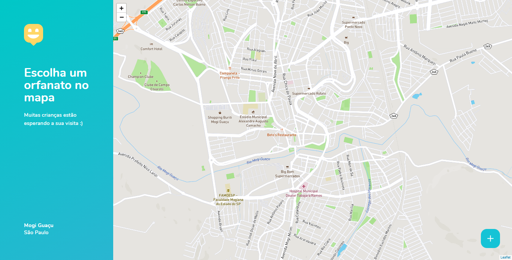

## Happy

O Happy tem como missão auxiliar crianças carentes, facilitando a visita de voluntários a orfanatos. Desenvolvido durante a 3° edição da Next Level Week.

<br>

<p align="center">
  
  
</p>

<br>

## Tecnologias

As seguintes tecnologias foram utilizadas no desenvolvimento do projeto:

- [TypeScript](https://www.typescriptlang.org/)
- [React](https://reactjs.org/)
- [React Native](https://reactnative.dev/)
- [Expo](https://expo.io/)
- [Express](https://expressjs.com/)
- [Node](https://nodejs.org/en/)
- [SQLite3](https://www.sqlite.org/index.html)
- [TypeORM](https://typeorm.io/)
- [Leaflet](https://leafletjs.com/)
- [Mapbox](https://www.mapbox.com/)

<br>

## Instalação e uso

### API (Back-end)

```bash
# Entre na pasta backend 
$ cd backend

# Instale as dependências
$ yarn install

# Rode o servidor
$ yarn dev
```

<br>

### Web (Front-end)

```bash
# Entre na pasta web com 
$ cd web

# Instale as dependências
$ yarn install

# Rode a aplicação
$ yarn start
```

<br>

